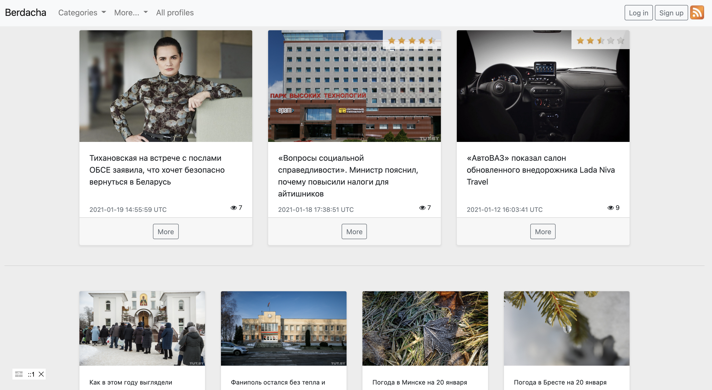

<a text-align="center" href="#about">About</a>&nbsp;&nbsp;&nbsp;|&nbsp;&nbsp;&nbsp;
<a href="#bw">Built With</a>&nbsp;&nbsp;&nbsp;|&nbsp;&nbsp;&nbsp;
<a href="#gs">Getting Started</a>&nbsp;&nbsp;&nbsp;|&nbsp;&nbsp;&nbsp;
<a href="#author">Author</a>

This project aims to demonstrate my knowledge of the object-oriented programming language in Ruby, as well as the Rails web application framework. My web application is a news portal.

# About news portal - Berdacha 

###General description:
The system allows users to view news content according to
with access rights.

###Main roles:
1. Administrator
2. Editor
3. Correspondent
4. Registered user

###The main components of the news
- Title
- Short description
- Full text
- Category
- Access mask (news is visible to everyone, the title and annotation are visible, only
title, hidden from unregistered users)
- Main image (for display in lists)
- A set of other images (to be displayed in the full text of the news)
- Date added (automatically)
- Tag List
- Region
- Date of last editing (if it was edited after publication)
- Status (inactive, active, published, archive; default - inactive)
- “Important” flag (false default) 
- Rating
- Editor
- Average rating (not available for editing)

###Home page
Blocks (or you can call them - feeds) news:
- important news
- news list (by category)
- most read
- most commented
- latest updates

For each news, the main image, the date of adding (or the last editing, in the case when it took place) is shown

###Category
News are divided into categories.

###News view page
On the news view page, the news text is displayed in accordance with the rights
user access.

Authorized regular users can only see published news.

Unauthorized users can view the news in accordance with its
access mask only to a limited extent (except “visible to all”).
In case of incomplete viewing of the news, users should have a link to register.

After successful registration, you need to redirect users to the full news page.

Also, when viewing, transitions to the lists "related materials" and "more by
topic"(materials related to regions, categories, tags, etc.)

###News life cycle
News is written only by correspondents.
Until the editor's approval, the news should not be visible to other users.
The news is published (becomes visible to everyone) only after the editor's approval.

The editor can also reject the news with a comment, thereby sending the news for revision.

###RSS interaction
You can export news to RSS.
Automatically fetch news from third-party RSS (once a day).
Only the site administrator is responsible for setting up RSS.

###User profile
On the user's profile page, in addition to general requirements, a link to the user's activity page is implemented.
A list (table) of all comments made by him (with a link to the news), as well as the news he viewed, has been added to the user's activities page. The user has the ability to do server pagination and sorting in the table.

Depending on the settings, the user can hide their news views from other users.

The user profile can be accessed by all registered users to view. For unregistered users only the truncated profile (avatar and name) is shown.

###Subscription to news digest (with letter)
Each registered user has the opportunity to subscribe to news according to parameters - category, tags, region.
In case of news publication, the user receives a letter with a list of news (short description and main image).
The news digest comes depending on the settings (the letter can be received - instantly, once a day, in two days or once a week). If necessary, there is a possibility of settings for the approximate time of receipt of such a letter.

###Comments
Any registered users can leave comments to the news.

###Rating
Registered users should be able to rate the news.

###Social networks
The ability to share the news on social networks (one social network to choose from).

###Reports
This functionality is available only to the administrator.
The reports are based on the collected analytical data.
The page has the ability to select the start and end date.
After clicking the button for receiving the report, the report is sent by email. The report includes a list of news (with links) and for each news:

- Date of publication
- Date of last edit
- Number of views
- Number of comments
- The ratio of registered views to unregistered views
- Average rating
- Top 5 countries that viewed the news

On the news viewing page, charts are available (available only to the admin):

1) Change in average news rating over time (line chart)
2) Percentage of countries of users who viewed the news (pie chart)

###Analytics
Views statistics are collected for each news. The following information is remembered - the country from which the news was viewed, the browser, the user id (it can be empty if it is not registered), the viewing time, the IP address.

# Built With 

- Ruby 2.6.3
- Rails 6.0.3.4
- PostgreSQL 13.0
- Bootstrap 4.0

# Getting Started 

To get a local copy of the repository please run the following commands on your terminal:
~~~bash
$ cd <folder>
$ git clone https://github.com/berkovichpavel/news_portal_iTechArt.git
~~~

**Install gems with:**
~~~bash
$ bundle install
~~~

**Install project manager**
~~~bash
$ yarn or npm install
~~~

**Setup database with:**
>make sure you have postgress sql installed and running on your system
~~~bash
$ rails db:create
$ rails db:migrate
$ rails db:seed   # install sample list data
~~~

**Start sidekiq with:**
>make sure you have redis installed and running on your system
~~~bash
$ sidekiq
~~~

**Update crone with:**
~~~bash
$ bundle exec whenever --user <user> --update-crontab --crontab-command 'sudo crontab'
~~~

**Start server with:**
~~~bash
$ rails s
~~~

This app should be running at `http://localhost:3000/`

# Author 

👤 **Berkovich Pavel**

- Github: [https://github.com/berkovichpavel](https://github.com/berkovichpavel)
- Telegram: [https://t.me/BerkovichPavel](https://t.me/BerkovichPavel)
- Linkedin: [https://www.linkedin.com/in/pavel-berkovich-9844251a4/](https://www.linkedin.com/in/pavel-berkovich-9844251a4/)
